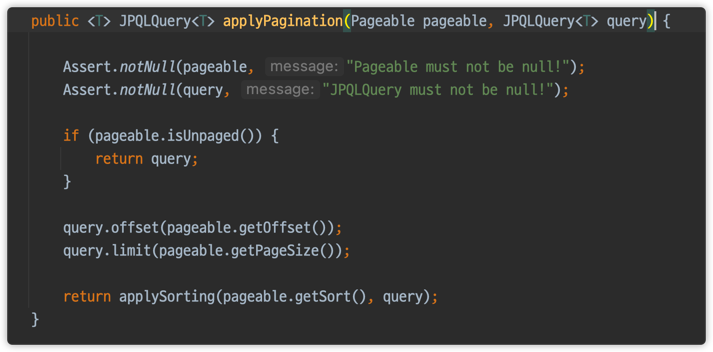

# QuerydslRepositorySupport

```java
package org.springframework.data.jpa.repository.support;

...

@Repository
public abstract class QuerydslRepositorySupport {

	private final PathBuilder<?> builder;

	private @Nullable EntityManager entityManager;
	private @Nullable Querydsl querydsl;

	/**
	 * Creates a new {@link QuerydslRepositorySupport} instance for the given domain type.
	 *
	 * @param domainClass must not be {@literal null}.
	 */
	public QuerydslRepositorySupport(Class<?> domainClass) {

		Assert.notNull(domainClass, "Domain class must not be null!");
		this.builder = new PathBuilderFactory().create(domainClass);
	}

	/**
	 * Setter to inject {@link EntityManager}.
	 *
	 * @param entityManager must not be {@literal null}.
	 */
	@Autowired
	public void setEntityManager(EntityManager entityManager) {

		Assert.notNull(entityManager, "EntityManager must not be null!");
		this.querydsl = new Querydsl(entityManager, builder);
		this.entityManager = entityManager;
	}

	/**
	 * Callback to verify configuration. Used by containers.
	 */
	@PostConstruct
	public void validate() {
		Assert.notNull(entityManager, "EntityManager must not be null!");
		Assert.notNull(querydsl, "Querydsl must not be null!");
	}

	/**
	 * Returns the {@link EntityManager}.
	 *
	 * @return the entityManager
	 */
	@Nullable
	protected EntityManager getEntityManager() {
		return entityManager;
	}

	/**
	 * Returns a fresh {@link JPQLQuery}.
	 *
	 * @param paths must not be {@literal null}.
	 * @return the Querydsl {@link JPQLQuery}.
	 */
	protected JPQLQuery<Object> from(EntityPath<?>... paths) {
		return getRequiredQuerydsl().createQuery(paths);
	}

	/**
	 * Returns a {@link JPQLQuery} for the given {@link EntityPath}.
	 *
	 * @param path must not be {@literal null}.
	 * @return
	 */
	protected <T> JPQLQuery<T> from(EntityPath<T> path) {
		return getRequiredQuerydsl().createQuery(path).select(path);
	}

	/**
	 * Returns a fresh {@link DeleteClause}.
	 *
	 * @param path
	 * @return the Querydsl {@link DeleteClause}.
	 */
	protected DeleteClause<JPADeleteClause> delete(EntityPath<?> path) {
		return new JPADeleteClause(getRequiredEntityManager(), path);
	}

	/**
	 * Returns a fresh {@link UpdateClause}.
	 *
	 * @param path
	 * @return the Querydsl {@link UpdateClause}.
	 */
	protected UpdateClause<JPAUpdateClause> update(EntityPath<?> path) {
		return new JPAUpdateClause(getRequiredEntityManager(), path);
	}

	/**
	 * Returns a {@link PathBuilder} for the configured domain type.
	 *
	 * @param <T>
	 * @return the Querdsl {@link PathBuilder}.
	 */
	@SuppressWarnings("unchecked")
	protected <T> PathBuilder<T> getBuilder() {
		return (PathBuilder<T>) builder;
	}

	/**
	 * Returns the underlying Querydsl helper instance.
	 *
	 * @return
	 */
	@Nullable
	protected Querydsl getQuerydsl() {
		return this.querydsl;
	}

	private Querydsl getRequiredQuerydsl() {

		if (querydsl == null) {
			throw new IllegalStateException("Querydsl is null!");
		}

		return querydsl;
	}

	private EntityManager getRequiredEntityManager() {

		if (entityManager == null) {
			throw new IllegalStateException("EntityManager is null!");
		}

		return entityManager;
	}
}
```

실제 사용은 다음과 같이 한다.
```java
public class MemberRepositoryImpl extends QuerydslRepositorySupport implements MemberRepositoryCustom {

  public MemberRepositoryImpl() {
    super(Member.class);
  }
  ...
}
```
엔티티 매니져를 가져오고 싶을 때
```java
EntityManager entityManager = getEntityManager();
```

쿼리는 다음과 같은 형태이다.
```java
List<MemberTeamDto> result = from(member) // querydsl 3 버전은 from으로 시작했었다.
                                         .leftJoin(member.team, team)
                                         .where(
                                                 usernameEq(condition.getUsername()),
                                                 teamNameEq(condition.getTeamName()),
                                                 ageGoe(condition.getAgeGoe()),
                                                 ageLoe(condition.getAgeLoe())
                                         )
                                         .select(new QMemberTeamDto(
                                                 member.id,
                                                 member.username,
                                                 member.age,
                                                 team.id,
                                                 team.name))
                                         .fetch();
```

- `from`으로 시작하는 것은 querydsl 3버전의 잔재

> 장점
- `getQuerydsl().applyPagination()`
  - 스프링 데이터가 제공하는 `페이징`을 Querydsl로 편리하게 변환 가능(단, `Sort`는 오류발생)

기존 페이징 코드
````java
@Override
public Page<MemberTeamDto> searchPageSimple(final MemberSearchCondition condition, final Pageable pageable) {
    QueryResults<MemberTeamDto> result = queryFactory
            .select(new QMemberTeamDto(
                    member.id,
                    member.username,
                    member.age,
                    team.id,
                    team.name))
            .from(member)
            .leftJoin(member.team, team)
            .where(
                    usernameEq(condition.getUsername()),
                    teamNameEq(condition.getTeamName()),
                    ageGoe(condition.getAgeGoe()),
                    ageLoe(condition.getAgeLoe())
            )
            .offset(pageable.getOffset())
            .limit(pageable.getPageSize()) // 한 페이지에 몇개까지?
            .fetchResults(); // 카운트 쿼리까지 가져옴

    List<MemberTeamDto> content = result.getResults();
    long total = result.getTotal();

    return new PageImpl<>(content, pageable, total);
}
````  

여기에서 페이징을 의미하는
```java
.offset(pageable.getOffset())
.limit(pageable.getPageSize())
```
를 다음과 같이 생략할 수 있다.
```java
JPQLQuery<MemberTeamDto> query = getQuerydsl().applyPagination(pageable, jpaQuery);
```


즉, QuerydslRepositorySupport를 이용하여 만든 페이지 쿼리는 다음과 같다.
```java
JPQLQuery<MemberTeamDto> jpaQuery = from(member)
        .leftJoin(member.team, team)
        .where(
                usernameEq(condition.getUsername()),
                teamNameEq(condition.getTeamName()),
                ageGoe(condition.getAgeGoe()),
                ageLoe(condition.getAgeLoe())
        )
        .select(new QMemberTeamDto(
                member.id,
                member.username,
                member.age,
                team.id,
                team.name));


JPQLQuery<MemberTeamDto> query = getQuerydsl().applyPagination(pageable, jpaQuery);
```

사용은 다음과 같이 하면 된다.
```java
query.fetchResults();
query.fetch();
...
```

- `from()` 으로 시작 가능(최근에는 QueryFactory를 사용해서 select() 로 시작하는 것이 더 명시적)
- `EntityManager` 제공

> 한계
- Querydsl 3.x 버전을 대상으로 만듬
- Querydsl 4.x에 나온 JPAQueryFactory로 시작할 수 없음
  - `select`로 시작할 수 없음 (from으로 시작해야함 - 쿼리는 맨날 select로 시작하는데 from으로 시작하니까 눈에 잘 안들어오는..)
- QueryFactory 를 제공하지 않음
- 스프링 데이터 `Sort` 기능이 정상 동작하지 않음
- 페이징도 메서드 체이닝이 끊겨서 좀 ㅎㅎ 
