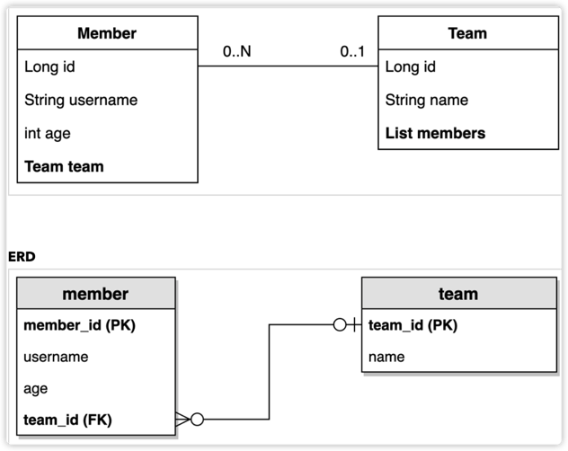

TEAM
```java
@Setter // 학습용
@Getter
@Entity
@NoArgsConstructor(access = AccessLevel.PROTECTED)
@ToString(of = { "id", "name" })
public class Team {
    @Id
    @GeneratedValue
    @Column(name = "team_id")
    private Long id;

    private String name;

    @OneToMany(mappedBy = "team")
    private List<Member> members = new ArrayList<>();

    public Team(String name) {
        this.name = name;
    }
}
```
- Member와 Team를 양방향 연관관계로 맺으려고 한다.
- 여기서 Member.team 이 연관관계의 주인이다.
- Team.members 는 연관관계의 주인이 아니다. 컬렉션일 뿐 
- 따라서 Member.team 이 데이터베이스 외래키 값을 변경, 반대편은 읽기만 가능

MEMBER
```java
@Setter // 학습용
@Entity
@Getter
@NoArgsConstructor(access = AccessLevel.PROTECTED)
@ToString(of = { "id", "username", "age" }) // Team이 있으면 무한 참조에 빠짐
public class Member {

    @Id
    @GeneratedValue
    @Column(name = "member_id")
    private Long id;
    private String username;
    private int age;

    @ManyToOne(fetch = FetchType.LAZY)
    @JoinColumn(name = "team_id")
    private Team team;

    public Member(String username) {
        this(username, 0);
    }

    public Member(String username, int age) {
        this(username, age, null);
    }

    public Member(String username, int age, Team team) {
        this.username = username;
        this.age = age;
        if (team != null) {
            changeTeam(team);
        }
    }

    public void changeTeam(Team team) {
        this.team = team;
        team.getMembers().add(this);
    }
}
```

- @Setter: 실무에서 가급적 Setter는 사용하지 마라!
- @NoArgsConstructor AccessLevel.PROTECTED: 기본 생성자 막고 싶은데, JPA 스펙상 최소 PROTECTED로 열어두어야함
- @ToString은 가급적 내부 필드만(연관관계 없는 필드만, 예를 들어 Team을 포함하면 무한 참조에 빠질 가능성이 ^^)


