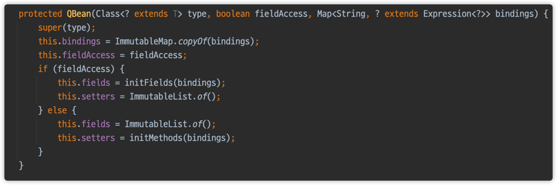

잘 보면, bean 방식은 field는 빈 객체로, setter 방식으로 값을 채워넣고 있다.
field 방식은 setter는 빈 객체로, field에 initFields 방식으로 값을 채워넣고 있다.

1. bean projection일 때
fieldAccess가 false
   
```java
private List<Method> initMethods(Map<String, ? extends Expression<?>> args) {
    try {
        List<Method> methods = new ArrayList<Method>(args.size());
        BeanInfo beanInfo = Introspector.getBeanInfo(getType());
        PropertyDescriptor[] propertyDescriptors = beanInfo.getPropertyDescriptors();
        for (Map.Entry<String, ? extends Expression<?>> entry : args.entrySet()) {
            String property = entry.getKey();
            Expression<?> expr = entry.getValue();
            Method setter = null;
            for (PropertyDescriptor prop : propertyDescriptors) {
                if (prop.getName().equals(property)) {
                    setter = prop.getWriteMethod();
                    if (!isAssignableFrom(prop.getPropertyType(), expr.getType())) {
                        typeMismatch(prop.getPropertyType(), expr);
                    }
                    break;
                }
            }
            if (setter == null) {
                propertyNotFound(expr, property);
            }
            methods.add(setter);
        }
        return methods;
    } catch (IntrospectionException e) {
        throw new RuntimeException(e.getMessage(), e);
    }
}

```
   
2. field projection일 때
fieldAccess가 true
   
```java
private List<Field> initFields(Map<String, ? extends Expression<?>> args) {
    List<Field> fields = new ArrayList<Field>(args.size());
    for (Map.Entry<String,? extends Expression<?>> entry : args.entrySet()) {
        String property = entry.getKey();
        Expression<?> expr = entry.getValue();
        Class<?> beanType = getType();
        Field field = null;
        while (!beanType.equals(Object.class)) {
            try {
                field = beanType.getDeclaredField(property);
                field.setAccessible(true);
                if (!isAssignableFrom(field.getType(), expr.getType())) {
                    typeMismatch(field.getType(), expr);
                }
                beanType = Object.class;
            } catch (SecurityException e) {
                // do nothing
            } catch (NoSuchFieldException e) {
                beanType = beanType.getSuperclass();
            }
        }
        if (field == null) {
            propertyNotFound(expr, property);
        }
        fields.add(field);
    }
    return fields;
}
```

내부에서 사용하는 MethodRef를 보면 다음과 같다. 이는 java.beans 패키지에 존재한다.
```java
final class MethodRef {
    private String signature;
    private SoftReference<Method> methodRef;
    private WeakReference<Class<?>> typeRef;

    void set(Method method) {
        if (method == null) {
            this.signature = null;
            this.methodRef = null;
            this.typeRef = null;
        }
        else {
            this.signature = method.toGenericString();
            this.methodRef = new SoftReference<>(method);
            this.typeRef = new WeakReference<Class<?>>(method.getDeclaringClass());
        }
    }

    boolean isSet() {
        return this.methodRef != null;
    }

    Method get() {
        if (this.methodRef == null) {
            return null;
        }
        Method method = this.methodRef.get();
        if (method == null) {
            method = find(this.typeRef.get(), this.signature);
            if (method == null) {
                this.signature = null;
                this.methodRef = null;
                this.typeRef = null;
                return null;
            }
            this.methodRef = new SoftReference<>(method);
        }
        return isPackageAccessible(method.getDeclaringClass()) ? method : null;
    }

    private static Method find(Class<?> type, String signature) {
        if (type != null) {
            for (Method method : type.getMethods()) {
                if (type.equals(method.getDeclaringClass())) {
                    if (method.toGenericString().equals(signature)) {
                        return method;
                    }
                }
            }
        }
        return null;
    }
}
```

그래서 writeMethod를 가져오는 코드는 다음과 같습니다.
Setter가 필요한 이유가 여기에 숨겨져 있네요.
```java
public synchronized Method getWriteMethod() {
        Method writeMethod = this.writeMethodRef.get();
        if (writeMethod == null) {
            Class<?> cls = getClass0();
            if (cls == null || (writeMethodName == null && !this.writeMethodRef.isSet())) {
                // The write method was explicitly set to null.
                return null;
            }

            // We need the type to fetch the correct method.
            Class<?> type = getPropertyType0();
            if (type == null) {
                try {
                    // Can't use getPropertyType since it will lead to recursive loop.
                    type = findPropertyType(getReadMethod(), null);
                    setPropertyType(type);
                } catch (IntrospectionException ex) {
                    // Without the correct property type we can't be guaranteed
                    // to find the correct method.
                    return null;
                }
            }

            if (writeMethodName == null) {
                writeMethodName = Introspector.SET_PREFIX + getBaseName();
            }

            Class<?>[] args = (type == null) ? null : new Class<?>[] { type };
            writeMethod = Introspector.findMethod(cls, writeMethodName, 1, args);
            if (writeMethod != null) {
                if (!writeMethod.getReturnType().equals(void.class)) {
                    writeMethod = null;
                }
            }
            try {
                setWriteMethod(writeMethod);
            } catch (IntrospectionException ex) {
                // fall through
            }
        }
        return writeMethod;
    }

```


## JPQL
```java
@DisplayName("dto로 프로젝션하기 - jpql 버전")
@Test
void dtoProjectionByJQPL() {
    // new operation을 활용하는 방법(패키지를 다 쓰는 과정이 좀 별로다!)
    List<MemberDto> result = em.createQuery("select new com.example.querydsl.dto.MemberDto(m.username, m.age) from Member m", MemberDto.class)
                               .getResultList();

    for (MemberDto memberDto : result) {
        System.out.println("memberDto = " + memberDto);
    }
}
```
- 순수 JPA에서 DTO를 조회할 때는 new 명령어를 사용해야한다. 
- DTO의 package 이름을 다 적어줘야해서 지저분함....ㅜㅜ
- 게다가 생성자 방식만 지원함

## Setter
```java
@DisplayName("querydsl으로 프로젝션 하기 - Setter") // getter/setter로 값을 넣음 <- 실험해보니 Getter는 의미없고, Setter로 동작함
@Test
void dtoProjectionByQuerydslSetter() {
    List<MemberDto> result = queryFactory
            .select(Projections.bean(MemberDto.class, member.username.as("name"), member.age)) // 필드명이 다르면 as로 해결. 여기서 as를 붙이지 않으면 name에 null이 출력된다.
            .from(member)
            .fetch();

    for (MemberDto memberDto : result) {
        System.out.println("memberDto = " + memberDto);
    }
}
```

## Field
```java
@DisplayName("querydsl으로 프로젝션 하기 - Field") // getter/setter 없이 값을 바로 필드에 넣음, 대신 이름이 같아야함. 필드명이 다르면 as로 해결
@Test
void dtoProjectionByQuerydslField() {
    List<MemberDto> result = queryFactory
            .select(Projections.fields(MemberDto.class, member.username.as("name"), member.age))
            .from(member)
            .fetch();

    for (MemberDto memberDto : result) {
        System.out.println("memberDto = " + memberDto);
    }
}
```

```java
@DisplayName("querydsl으로 프로젝션 하기 - SubQuery & Field") // getter/setter 없이 값을 바로 필드에 넣음, 대신 이름이 같아야함. 필드명이 다르면 as로 해결
@Test
void dtoProjectionByQuerydslField_ExpressionUtils() {
    QMember memberSub = new QMember("memberSub");
    List<MemberDto> result = queryFactory
            .select(Projections.fields(MemberDto.class,
                                       member.username.as("name"),
                                       ExpressionUtils.as(// ExpressionUtils를 이용하여 감싸면, 2번째 파라미터로 alias를 줄 수 있습니다.
                                                          JPAExpressions // subQuery
                                                                         .select(memberSub.age.max())
                                                                         .from(memberSub), "age")
            ))
            .from(member)
            .fetch();

    for (MemberDto memberDto : result) {
        System.out.println("memberDto = " + memberDto);
    }
}
```

- Setter나 Field 방식은 이름 매칭이 굉장히 중요한 부분이다.
- 프로퍼티나, 필드 접근 생성 방식에서 이름이 다를 때 해결 방안
    - ExpressionUtils.as(source,alias) : 필드나, 서브 쿼리에 별칭 적용 
    - username.as("memberName") : 필드에 별칭 적용

## Constructor

```java
@DisplayName("querydsl으로 프로젝션 하기 - Constructor")
@Test
void dtoProjectionByQuerydslConstructor() {
    List<MemberDto> result = queryFactory
            .select(Projections.constructor(MemberDto.class, member.username, member.age))
            .from(member)
            .fetch();

    for (MemberDto memberDto : result) {
        System.out.println("memberDto = " + memberDto);
    }
}
```