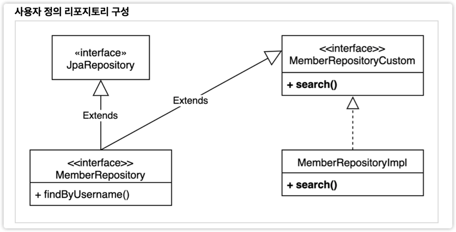

# 스프링 데이터 JPA 리포지토리로 변경
```java
public interface MemberRepository extends JpaRepository<Member, Long> {
    // method 이름으로 query : select m from Member m where m.username = :username
    List<Member> findByUsername(String username);
}
```

## 사용자 정의 리포지토리

사용자 정의 리포지토리 사용법

1. 사용자 정의 인터페이스 작성

```java
public interface MemberRepositoryCustom {
  List<MemberTeamDto> search(MemberSearchCondition condition);
}
```

2. 사용자 정의 인터페이스 구현
```java
/**
 * MemberRepository + Impl (규칙이 존재합니다. `Impl`)
 */
@RequiredArgsConstructor
public class MemberRepositoryImpl implements MemberRepositoryCustom {

    private final JPQLQueryFactory queryFactory;

    @Override
    public List<MemberTeamDto> search(final MemberSearchCondition condition) {
        return queryFactory
                .select(new QMemberTeamDto(
                        member.id,
                        member.username,
                        member.age,
                        team.id,
                        team.name))
                .from(member)
                .leftJoin(member.team, team)
                .where(
                        usernameEq(condition.getUsername()),
                        teamNameEq(condition.getTeamName()),
                        ageGoe(condition.getAgeGoe()),
                        ageLoe(condition.getAgeLoe())
                )
                .fetch();
    }

    private BooleanExpression usernameEq(final String username) { //BooleanExpression으로 해야 나중에 Composition이 가능하다.
        return StringUtils.hasText(username) ? member.username.eq(username) : null;
    }

    private BooleanExpression teamNameEq(final String teamName) {
        return StringUtils.hasText(teamName) ? team.name.eq(teamName) : null;
    }

    private BooleanExpression ageGoe(final Integer ageGoe) {
        return ageGoe != null ? member.age.goe(ageGoe) : null;
    }

    private BooleanExpression ageLoe(final Integer ageLoe) {
        return ageLoe != null ? member.age.loe(ageLoe) : null;
    }
}
```   
- Spring dataJpa에 의해 이 구현체는 Impl 규칙을 지켜 `Bean`으로 등록되어 사용할 수 있다.

3. 스프링 데이터 리포지토리에 사용자 정의 인터페이스 상속

```java
public interface MemberRepository extends JpaRepository<Member, Long>, MemberRepositoryCustom {
  List<Member> findByUsername(String username);
}
```

테스트
```java
@DisplayName("사용자 정의 레포지토리 테스트")
@Test
void customRepository() {
    Team teamA = new Team("teamA");
    Team teamB = new Team("teamB");
    em.persist(teamA);
    em.persist(teamB);

    Member member1 = new Member("member1", 10, teamA);
    Member member2 = new Member("member2", 20, teamA);
    Member member3 = new Member("member3", 30, teamB);
    Member member4 = new Member("member4", 40, teamB);
    em.persist(member1);
    em.persist(member2);
    em.persist(member3);
    em.persist(member4);

    MemberSearchCondition condition = new MemberSearchCondition();
    condition.setAgeGoe(35);
    condition.setAgeGoe(40);
    condition.setTeamName("teamB");

    List<MemberTeamDto> result = memberRepository.search(condition);
    assertThat(result).extracting("username").containsExactly("member4");
}
```
